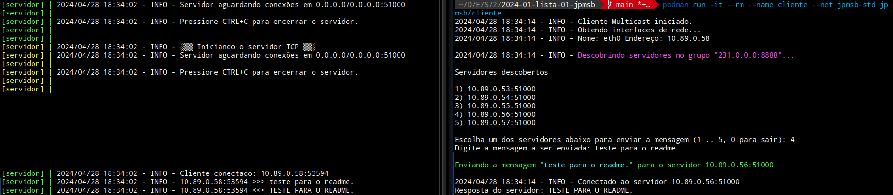
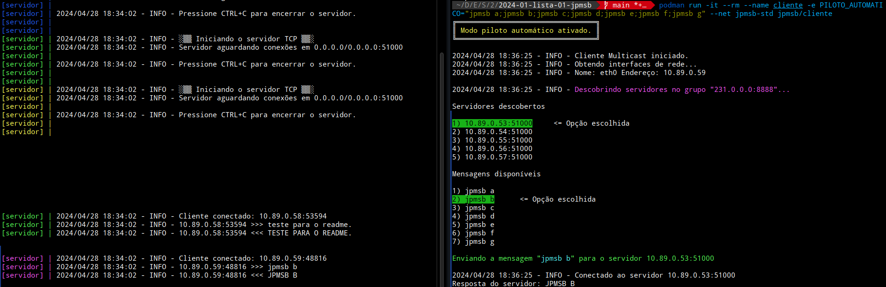
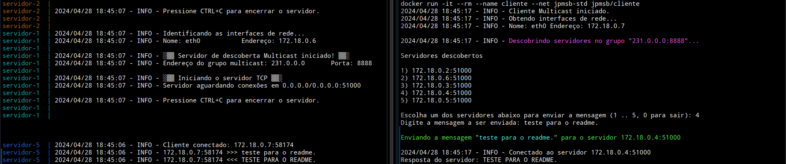
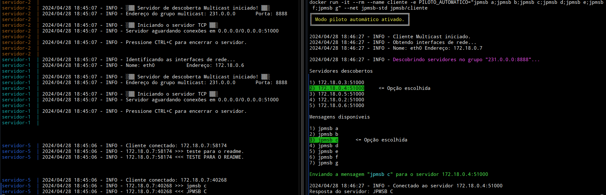

[](https://classroom.github.com/a/LMGyGhqY)

# Lista 1: Prática com contêineres e sockets TCP/IP em Java

Nesta atividade foram implementadas aplicações cliente e servidor que utilizam _sockets_ TCP para se encontrarem e comunicarem.

Além disso, é disponibilizado um arquivo [docker-compose.yml](docker-compose.yml) que cria um cenário.

**Este projeto foi testado com as ferramentas de contêiner Docker e Podman e foi utilizado o Java 17 com Gradle 8.7 para a criação das aplicações.**

## Teste automatizado

Para facilitar os testes com as aplicações, o arquivo [docker-compose.yml](docker-compose.yml) foi preparado de forma que crie todos os componentes necessarios para a criação do ambiente, como a criação de uma rede personalizada chamada `jpmsb-std`, a construção das imagens do cliente e servidor, utilizadas para a criação de seus respectivos contêineres. Além disso, na parte dos contêineres, são criadas réplicas que exploram o recurso de múltiplos servidores com múltiplos clientes.

Para realizar as instruções a seguir, clone este repositório e entre no diretório do mesmo:

```bash
git clone https://github.com/STD29006-classroom/2024-01-lista-01-jpmsb
cd 2024-01-lista-01-jpmsb
```

## Instanciação dos servidores

Para instanciar os servidores, basta executar o comando abaixo:

```bash
docker compose up servidor
```

Isso criará 5 instâncias do servidor, conforme definido na diretiva `replicas` do arquivo [docker-compose.yml](docker-compose.yml).

A imagem utilizada é `jpmsb/servidor` e, caso a mesma não exista, é contruída a partir do [Dockerfile](servidor/Dockerfile) do servidor.

A rede utilizada é a `jpmsb-std`, que é criada automaticamente pelo Docker Compose, caso ainda não exista.

Se estiver utilizando o Podman, basta substituir o comando `docker` por `podman`.

## Instanciação dos clientes autônomos

Para instanciar os clientes, basta executar o comando abaixo:

```bash
docker compose up cliente
```

Isso criará 20 instâncias do cliente, conforme definido na diretiva `replicas` do arquivo [docker-compose.yml](docker-compose.yml).

Note que o cenário foi configurado de forma que o cliente opere de forma autônoma, o qual um servidor e uma mensagem são automaticamente selecionados. As mensagens para teste estão localizadas no arquivo [.env](.env), atribuídas a variável `PILOTO_AUTOMATICO`. O separador é o caractere `;`.

O objetivo de criar clientes autônomos é para facilitar a simulação de vários clientes realizando descoberta de servidor e comunicação simultaneamente.

Para instanciar um cliente interativo, veja a [documentação do cliente](cliente/README.md).

## Testes realizados

### Podman

Com os servidores iniciados com:

```bash
podman compose up servidor
```

No primeiro teste, foi instanciado um cliente no modo de operação interativa:

```bash
podman run -it --rm --name cliente --net jpmsb-std jpmsb/cliente
```

O resultado é mostrado na imagem abaixo:



No segundo teste, foi instanciado um cliente autônomo:

```bash
podman run -it --rm --name cliente -e PILOTO_AUTOMATICO="jpmsb a;jpmsb b;jpmsb c;jpmsb d;jpmsb e;jpmsb f;jpmsb g" --net jpmsb-std jpmsb/cliente
```

O resultado é mostrado na imagem abaixo:



### Docker

Para a verficação da compatibilidade, o mesmo teste foi realizado com o Docker. Os servidores foram instanciados com o comando:

```bash
docker compose up servidor
```

No primeiro teste, foi instanciado um cliente no modo de operação interativa:

```bash
docker run -it --rm --name cliente --net jpmsb-std jpmsb/cliente
```

O resultado é mostrado na imagem abaixo:



No segundo teste, foi instanciado um cliente autônomo:

```bash
docker run -it --rm --name cliente -e PILOTO_AUTOMATICO="jpmsb a;jpmsb b;jpmsb c;jpmsb d;jpmsb e;jpmsb f;jpmsb g" --net jpmsb-std jpmsb/cliente
```

O resultado é mostrado na imagem abaixo:



## Documentação individual

 - [Servidor](servidor/README.md)
 - [Cliente](cliente/README.md)

## Atendimentos dos requisitos da atividade

Todos os requisitos da atividade foram atendidos. Os mesmos são listados abaixo:

 - A aplicação cliente é capaz de descobrir servidores em uma rede local via *multicast* e permite que o usuário escolha o servidor com o qual deseja se comunicar;
 - O servidor consegue atender vários clientes simultaneamente;
 - Os projetos do cliente e servidor estão separados em diretórios diferentes, sendo que o diretório do projeto do servidor está no diretório [servidor](servidor/servidor) e o diretório do projeto do cliente está no diretório [cliente](cliente/cliente);
 - Os códigos foram comentados e foi realizada a documentação JavaDoc para os métodos;
 - Foram realizados testes com múltiplos servidores e múltiplos clientes, utilizando o Docker Compose para montar o cenário;
 - O projeto faz uso de contêneinres, sendo compatível com as ferramentas Docker e Podman.