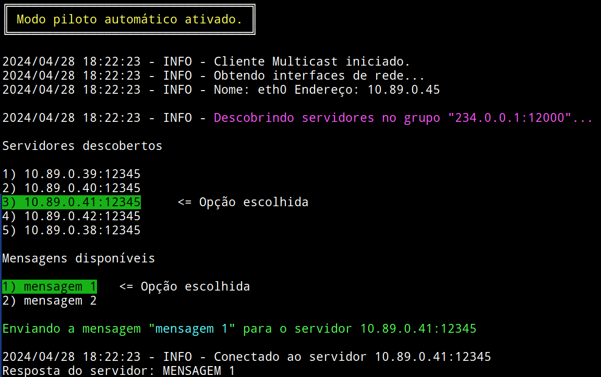

# Cliente

O diretório [cliente](cliente/) contém a implementação da parte cliente deste projeto. Ele possui duas partes: cliente _multicast_ para a descoberta dos servidores ativos e cliente TCP para enviar a mensagem para o servidor escolhido.

**O cliente não precisa saber de nenhuma informação do servidor TCP de antemão, ou seja, tanto o endereço do servidor quanto a porta a qual o mesmo está escutando, são descobertos na parte de _multicast_. Isso permite, inclusive, que haja servidores escutando em portas diferentes.**

## Preparação

Primeiramente, para realizar as instruções a seguir, clone este repositório e entre no diretório do mesmo:

```bash
git clone https://github.com/STD29006-classroom/2024-01-lista-01-jpmsb
cd 2024-01-lista-01-jpmsb
```

## Construção da imagem do cliente

Para criar a imagem de contêiner do cliente, execute o comando abaixo:

```bash
docker build -t jpmsb/cliente cliente
```

Verifique a criação com o comando:

```bash
docker images

REPOSITORY      TAG     IMAGE ID      CREATED        SIZE
jpmsb/cliente  latest   c27ca4dfb147  3 minutes ago  167 MB
```

## Criação da rede personalizada

Caso a mesma ainda não exista, crie a rede personalizada com o comando abaixo:

```bash
docker network create jpmsb-std
```

## Instanciação do cliente

Para instanciar o cliente, basta executar o comando abaixo:

```bash
docker run -it --rm --name cliente --net jpmsb-std jpmsb/cliente
```

A saída na tela deverá ser semelhante ao mostrado abaixo:

```
2024/04/28 17:45:10 - INFO - Cliente Multicast iniciado.
2024/04/28 17:45:10 - INFO - Obtendo interfaces de rede...
2024/04/28 17:45:10 - INFO - Nome: eth0 Endereço: 10.89.0.10

2024/04/28 17:45:10 - INFO - Descobrindo servidores Descobrindo servidores no grupo "231.0.0.0:8888"...

Servidores descobertos

1) 10.89.0.5:51000
2) 10.89.0.6:51000
3) 10.89.0.7:51000
4) 10.89.0.8:51000
5) 10.89.0.9:51000

Escolha um dos servidores abaixo para enviar a mensagem (1 .. 5, 0 para sair):
```

Neste momento, é solicitado ao usuário que escolha um dos servidores listados para enviar a mensagem. Supondo que o servidor escolhido seja o de número 3), a aplicação procede para perguntar ao usuário qual mensagem deseja enviar:

```
2024/04/28 17:45:10 - INFO - Cliente Multicast iniciado.
2024/04/28 17:45:10 - INFO - Obtendo interfaces de rede...
2024/04/28 17:45:10 - INFO - Nome: eth0 Endereço: 10.89.0.10

2024/04/28 17:45:10 - INFO - Descobrindo servidores no grupo "231.0.0.0:8888"...

Servidores descobertos

1) 10.89.0.5:51000
2) 10.89.0.6:51000
3) 10.89.0.7:51000
4) 10.89.0.8:51000
5) 10.89.0.9:51000

Escolha um dos servidores abaixo para enviar a mensagem (1 .. 5, 0 para sair): 3
Digite a mensagem a ser enviada:
```

Após a mensagem ser digitada, a mesma é enviada para o servidor escolhido e a resposta é exibida na tela:

```
2024/04/28 17:45:10 - INFO - Cliente Multicast iniciado.
2024/04/28 17:45:10 - INFO - Obtendo interfaces de rede...
2024/04/28 17:45:10 - INFO - Nome: eth0 Endereço: 10.89.0.10

2024/04/28 17:45:10 - INFO - Descobrindo servidores Descobrindo servidores no grupo "231.0.0.0:8888"...

Servidores descobertos

1) 10.89.0.5:51000
2) 10.89.0.6:51000
3) 10.89.0.7:51000
4) 10.89.0.8:51000
5) 10.89.0.9:51000

Escolha um dos servidores abaixo para enviar a mensagem (1 .. 5, 0 para sair): 3
Digite a mensagem a ser enviada: teste para a documentação.

Enviando a mensagem "teste para a documentação." para o servidor 10.89.0.7:51000

2024/04/28 17:45:10 - INFO - Conectado ao servidor 10.89.0.7:51000
Resposta do servidor: TESTE PARA A DOCUMENTA��O.
```

**Observação: caracteres especiais e com acentuação não são decodificados corretamente.**

É possível utilizar variáveis de ambiente para mudar o comportamento do cliente. As seguintes variáveis estão disponíveis:

 - `ENDERECO_MULTICAST`: Endereço do grupo multicast. Padrão: `231.0.0.0`;
 - `PORTA_MULTICAST`: Porta do grupo multicast. Padrão: `8888`;
 - `TEMPO_LIMITE_PARA_DESCOBERTA`: Tempo limite para descoberta de servidores via _multicast_. Padrão: 3 segundos.
 - `PILOTO_AUTOMATICO`: Ao ser definida com uma ou mais mensagens, separadas por `;`, o cliente entrará em modo autônomo e tanto a escolha do servidor quanto a escolha da mensagem serão automáticas. Caso esta variável não seja definida, o cliente operará de forma interativa.

Por exemplo:

```bash
docker run -it --rm --name cliente --net jpmsb-std -e ENDERECO_MULTICAST="234.0.0.1" -e PORTA_MULTICAST="12000" -e PILOTO_AUTOMATICO="mensagem 1;mensagem 2" jpmsb/cliente
```

O comando acima produzirá a saída abaixo:

```
╔═════════════════════════════════╗
║ Modo piloto automático ativado. ║
╚═════════════════════════════════╝

2024/04/28 18:22:23 - INFO - Cliente Multicast iniciado.
2024/04/28 18:22:23 - INFO - Obtendo interfaces de rede...
2024/04/28 18:22:23 - INFO - Nome: eth0 Endereço: 10.89.0.45

2024/04/28 18:22:23 - INFO - Descobrindo servidores no grupo "234.0.0.1:12000"...

Servidores descobertos

1) 10.89.0.39:12345
2) 10.89.0.40:12345
3) 10.89.0.41:12345     <= Opção escolhida
4) 10.89.0.42:12345
5) 10.89.0.38:12345

Mensagens disponíveis

1) mensagem 1   <= Opção escolhida
2) mensagem 2

Enviando a mensagem "mensagem 1" para o servidor 10.89.0.41:12345

2024/04/28 18:22:23 - INFO - Conectado ao servidor 10.89.0.41:12345
Resposta do servidor: MENSAGEM 1
```

Em um terminal, a saída acima é colorida, conforme mostrado na captura de tela abaixo:



**Note que os comandos utilizados destroem o contêiner quando o mesmo for encerrado.**

Caso esteja utilizando o Podman, basta substituir o comando `docker` por `podman`.